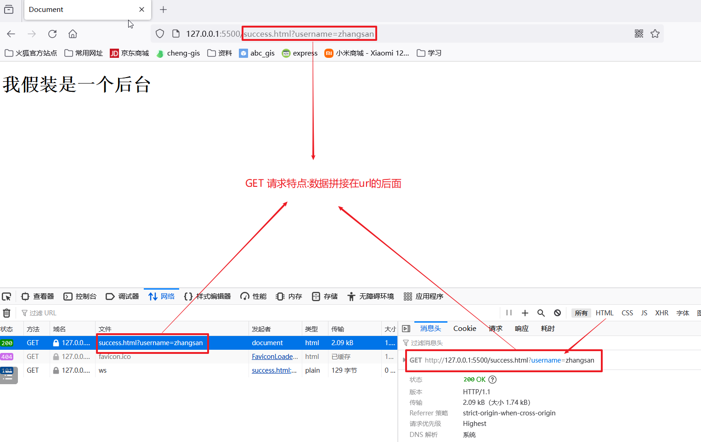
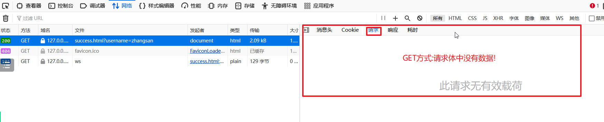

#### 昨日回顾

```
html相关概念
	是什么
		超文本标记语言
	有什么用
		描述一个页面
	怎么用
		使用合适的标签搭建页面的骨架,使用属性来控制样式
	特点
		语法非常的宽松
		不区分大小写
		标签是预定义好的
	语法
		标签(元素)
		标签体(内容)
		属性
		注释
		特殊字符
html常见标签
	文档相关的标签
		html
			head
				meta
				title
			body
	
	文本相关的标签
		font
		h1-h6
		p
	
	格式相关的标签
		hr
		br 
		b strong
		i em
		u
		del
		mark
```

#### 列表相关标签

```
无序列表
	    无序列表  
            ul(unorder list)

            type属性取值
                disc	默认值。实心圆。
                circle	空心圆。
                square	实心方块。

        列表项
            li(list item)
            
            
有序列表
	   有序列表  
            ol(order list)

            type属性取值	
                a 表示小写英文字母编号
                A 表示大写英文字母编号
                i 表示小写罗马数字编号
                I 表示大写罗马数字编号
                1 表示数字编号（默认）

        列表项
            li(list item)
```


#### 标签分类

依据:标签能否独占一行

##### 行级元素

```
特点
	默认不能独占一行,上一行有空间就在上一行显示,如果没有空间,才会另起一行
纯粹的行级元素
	span:默认没有任何样式,默认不可以换行,后期可以使用css来设置样式
	     主要作用:用于分隔一行内容,或者存放少量数据
```


##### 块级元素

```
特点
	默认独占一行,不管上一行有没有空间,直接另起一行显示
纯粹的块级元素
	div:默认没有任何样式,默认可以换行,后期可以使用css来设置样式
		主要作用:划分区域,设置页面布局(主流布局:div+css)
```


#### 图片媒体标签

##### 图片标签

```
标签名 img
	重要属性
		src 图片的路径,推荐使用相对路径
			1,图片在html文档的下一级目录: ./图片目录名/图片名 或者 图片目录名/图片名
            2,图片在html文档的同一级目录: ./图片名 或者 直接使用图片名
            3,图片在html文档的上一级目录: ../图片名(../代表回退上一级目录)
    其他属性
        width   规定图片的宽度
        height 规定图片的高度
        alt    规定图片的替代文本(图片无法显示的时候才会出现)
        title 鼠标经过图片的提示文字
```


##### 音频标签

```
audio 音频标签
	src  音频文件的路径

    controls	
        controls	如果出现该属性，则向用户显示音频控件（比如播放/暂停按钮）。
        controls 属性是一个布尔属性。如果属性存在，它指定音频控件的显示方式。
```

##### 视频标签

```
video 视频标签
    src  视频文件的路径

    controls	
        controls	如果出现该属性，则向用户显示视频控件（比如播放/暂停按钮）。
        controls 属性是一个布尔属性。如果属性存在，它指定视频控件的显示方式。

    autoplay 	autoplay	如果出现该属性，则视频在就绪后马上播放。

    muted	muted	如果出现该属性，视频的音频输出为静音。
```


#### 链接相关标签

```
标签名 a
	属性
		href  链接的url
		target 链接的打开方式
		
链接的分类
	站外链接
	站内链接
	锚链接
```

#### 布局相关标签

```
概念
	一个语义元素能够清楚的描述其意义给浏览器和开发者。
	HTML5 提供了新的语义元素来明确一个Web页面的不同部分
	之前头部<div class='header'> 底部<div class='footer'> 导航栏<div class='nav'>
	现在写法 头部<header> 底部<footer> 导航栏<nav>
	
	这些标签也称为语义化标签,没有任何样式,主要用于划分不同的区域,便于页面布局
	
组成
	<header>元素描述了文档的头部区域
	<main>元素描述了文档的主体区域
	<footer> 元素描述了文档的底部区域
	<aside> 标签定义页面主区域内容之外的内容（比如侧边栏）。
	<section> 标签定义文档中的节（section、区段）。比如章节、页眉、页脚或文档中的其他部分。
	<article> 标签定义独立的内容。.
```


#### 表单相关标签

```
概念
	HTML 表单用于收集用户的输入信息。
	HTML 表单表示文档中的一个区域，此区域包含交互控件，将用户收集到的信息发送到 Web 服务器。
	HTML 表单通常包含各种输入字段、复选框、单选按钮、下拉列表等元素。
	
组成
	form标签(表单标签)
	input标签(输入项标签)
	select标签(下拉选择框标签)
	textarea标签(文本域标签)
	
详细讲解
	form标签(表单标签):用于限定表单提交的范围,设置提交的地址和方式
        重要属性    
            action:设置表单提交的地址,默认提交到当前页面
            method:规定用于发送表单数据的 HTTP 方法(设置表单的提交方式)
                get	默认。将表单数据以名称/值对的形式附加到 URL 中：
                     URL?name=value&name=value。
                    特点:相对的不安全,只能提交少量数据
                post: 将表单数据附加到 HTTP 请求的 body 内（数据不显示在 URL 中）
                    特点:相对的安全,可以提交大量数据,主要用于文件上传或者提交一些敏感信息

    input标签(输入项标签)
        重要属性
            type 根据不同的取值显示不同的输入控件
                text 文本框
                password 密码框
                radio 单选框
                checkbox 复选框
                file 文件上传框
                submit 提交按钮(将表单数据提交到后台)
                reset 重置按钮(恢复页面刚打开时的效果)
                button 普通按钮(将来和js一起使用)

    select标签(下拉选择框标签)
    textarea标签(文本域标签)

    通用属性
        name
            1,规定input元素的名称,只有设置了name属性,才能将这个表单项的数据提交到后台
            2,可以为单选和复选框进行分组,同一组的单选框,一次只能选择一个选项

        value
            1,对于单选和复选,需要指定value属性的值,用于在后台区分用户到底选择了哪一个选项
```

GET请求特点截图





POST请求的特点截图


